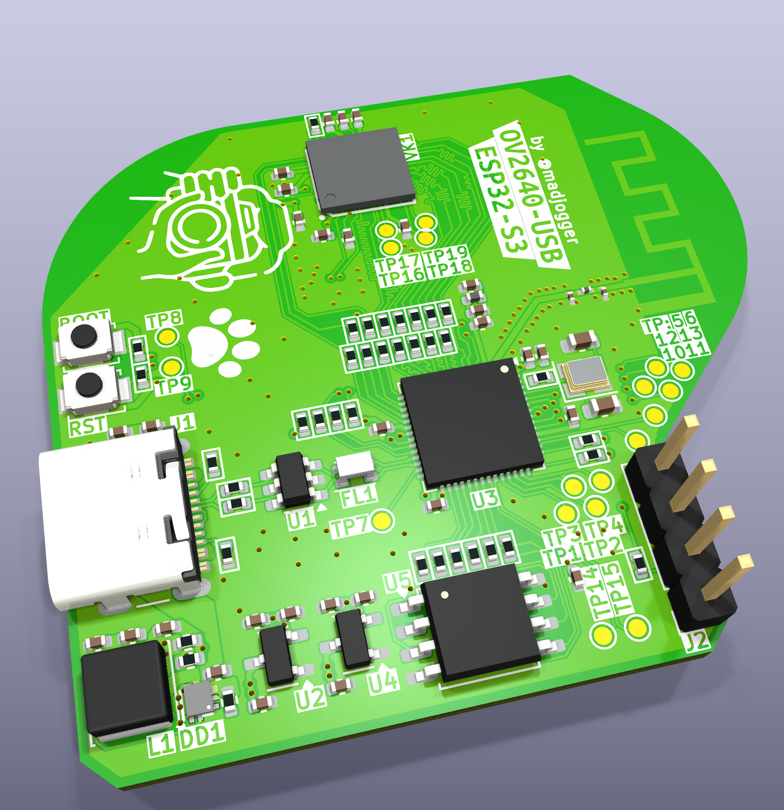

# USB-OV2640-module  

> Compact USB camera module based on **ESP32-S3** with directly soldered **OV2640** sensor (BGA footprint).  
> Conceptually close to ESP32-CAM, but implemented in a **USB stick form factor** with integrated antenna and memory.  
> Designed as a flexible platform that can later be adapted to other sensors and microcontrollers.  

---

## What’s on the board  
- **ESP32-S3 microcontroller**  
>  - Native **DVP camera interface** for OV2640  
>  - USB 2.0 device controller (Type-C connector)  
- **OV2640 camera sensor** in BGA package (soldered directly)  
>  - Data lines matched in length with pixel clock  
>  - Pin mapping (see table below)  
- **External memories**:  
>  - **W25Q64JVSSIQ** (SPI NOR Flash, 64 Mbit)  
>  - **LY68L6400SLIT** (PSRAM, 64 Mbit)  
- **PCB antenna**
>  - LC matching network (tunable if needed)  
- **Power & protection**:  
>  - ESD protection on USB data and power  
>  - Small differential USB filter  
- **Debug & programming**:  
>  - BOOT and RESET buttons  
>  - UART broken out for flashing/debug  
>  - Extra GPIOs exposed (see table below)  
>  - JTAG pads (MTCK, MTDO, MTDI, MTMS)  ы

---

## Pinout (ESP32-S3 ↔ OV2640)  

| ESP32-S3 GPIO | OV2640 Signal | Notes |
|---------------|---------------|-------|
| GPIO1  | Y9    | Data bus |
| GPIO2  | Y8    | Data bus |
| GPIO3  | Y7    | Data bus |
| GPIO4  | Y6    | Data bus |
| GPIO5  | Y5    | Data bus |
| GPIO6  | Y4    | Data bus |
| GPIO7  | Y3    | Data bus |
| GPIO8  | Y2    | Data bus |
| GPIO9  | PCLK  | Pixel clock |
| GPIO10 | XVCLK | External clock |
| GPIO11 | HREF  | Horizontal reference |
| GPIO12 | VSYNC | Vertical sync |
| GPIO13 | RESETB | Sensor reset |
| GPIO18 | SIO_C | SCCB/I²C clock |
| GPIO17 | SIO_D | SCCB/I²C data |
| GPIO14 | STROBE | Camera strobe |
| GPIO38 | FREX   | Frame exposure |
| GPIO37 | EXPST_B | Exposure start |

---

## Extra Exposed GPIOs  

| GPIO   | Possible Functions (ESP32-S3 datasheet) |
|--------|-----------------------------------------|
| GPIO33 | ADC1_CH2 • Touch5 • RMT • SPI • UART • PWM |
| GPIO34 | ADC1_CH3 • Touch6 • RMT • SPI • UART • PWM |
| GPIO35 | ADC1_CH4 • Touch7 • RMT • SPI • UART • PWM |
| GPIO36 | ADC1_CH5 • Touch8 • RMT • SPI • UART • PWM |
| GPIO45 | General-purpose IO (no ADC/touch) • HSPI/VSPI • PWM • UART |
| GPIO46 | Input-only • Strapping pin • Can be used as input for boot mode, JTAG, etc. |
| GPIO21 | ADC2_CH0 • Touch0 • I²C SDA • UART • PWM |
| GPIO15 | ADC2_CH4 • Touch3 • I²C SCL • UART • PWM |
| GPIO16 | ADC2_CH5 • Touch4 • SPI • UART • PWM |

*Notes:*  
>- **ADC1** and **ADC2** allow analog measurements (12-bit).  
>- **TouchX** functions support capacitive touch sensing.  
>- **RMT** = Remote Control peripheral (good for IR / precise waveforms).  
>- GPIO45/46 often used in special boot/JTAG scenarios — check strapping requirements.  
>- All can be remapped to **UART / I²C / SPI / PWM** as needed (ESP32-S3 flexible IO matrix).  

---

## Power & Form Factor  
>- Powered directly from **USB Type-C**  
>- Compact **2-layer PCB** for low-cost manufacturing  
>- No external power required  

---

## Use Case  
>- Drop-in USB camera module with OV2640 sensor  
>- Alternative to ESP32-CAM with direct USB interface  
>- For prototyping, computer vision, robotics, and IoT devices  

---

## Quick Use  
>1. Connect **USB-OV2640-module** to PC via USB-C.  
>2. Hold **BOOT** and press **RESET** to enter download mode.  
>3. Flash ESP32-S3 firmware (e.g. ESP-IDF / Arduino / PlatformIO).  
>4. Use provided OV2640 driver examples (similar to ESP32-CAM).  
>5. Stream video over USB (UVC emulation) or Wi-Fi.  

---

## Notes  
>- Antenna may require LC matching calibration depending on PCB batch.  
>- OV2640 mounted directly in BGA footprint (reflow soldering required).  
>- Camera lines length-matched for stable operation at full pixel clock.  
>- PCB made as **2-layer** design for cost efficiency.  

---
